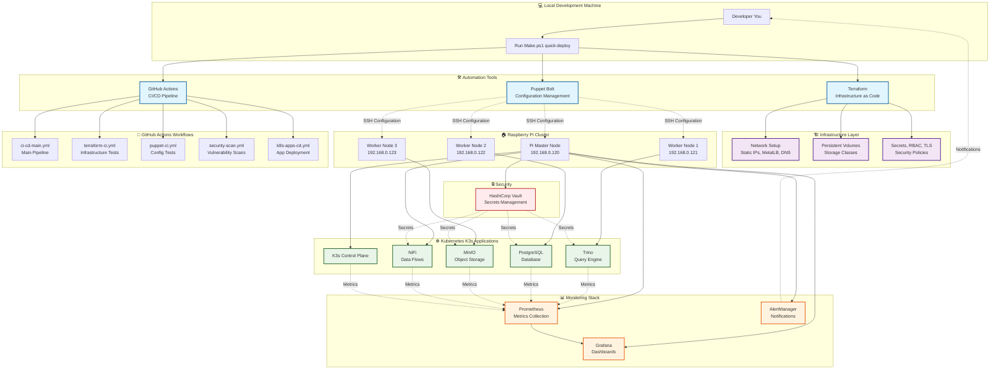

```mermaid
flowchart TD
    subgraph LocalDev["💻 Local Development Machine"]
        A[Developer You]
        B[Run Make.ps1 quick-deploy]
        A --> B
    end

    subgraph AutoTools["🛠️ Automation Tools"]
        TF[Terraform<br/>Infrastructure as Code]
        PB[Puppet Bolt<br/>Configuration Management]
        GH[GitHub Actions<br/>CI/CD Pipeline]
    end

    subgraph Infrastructure["🏗️ Infrastructure Layer"]
        Net[Network Setup<br/>Static IPs, MetalLB, DNS]
        Vol[Persistent Volumes<br/>Storage Classes]
        Sec[Secrets, RBAC, TLS<br/>Security Policies]
    end

    subgraph PiCluster["🏠 Raspberry Pi Cluster"]
        M[Pi Master Node<br/>192.168.0.120]
        W1[Worker Node 1<br/>192.168.0.121]
        W2[Worker Node 2<br/>192.168.0.122]
        W3[Worker Node 3<br/>192.168.0.123]
    end

    subgraph K3sCluster["☸️ Kubernetes K3s Applications"]
        CP[K3s Control Plane]
        App1[Trino<br/>Query Engine]
        App2[PostgreSQL<br/>Database]
        App3[MinIO<br/>Object Storage]
        App4[NiFi<br/>Data Flows]
    end

    subgraph Monitoring["📊 Monitoring Stack"]
        Prom[Prometheus<br/>Metrics Collection]
        Graf[Grafana<br/>Dashboards]
        Alert[AlertManager<br/>Notifications]
    end

    subgraph Security["🔒 Security"]
        Vault[HashiCorp Vault<br/>Secrets Management]
    end

    subgraph CICD["🤖 GitHub Actions Workflows"]
        CI[ci-cd-main.yml<br/>Main Pipeline]
        TFCI[terraform-ci.yml<br/>Infrastructure Tests]
        PBCI[puppet-ci.yml<br/>Config Tests]
        Scan[security-scan.yml<br/>Vulnerability Scans]
        K8sCD[k8s-apps-cd.yml<br/>App Deployment]
    end

    %% Main workflow connections
    B --> TF
    B --> PB
    B --> GH

    %% Terraform creates infrastructure
    TF --> Net
    TF --> Vol
    TF --> Sec

    %% Puppet Bolt configures Pi nodes
    PB -.->|SSH Configuration| M
    PB -.->|SSH Configuration| W1
    PB -.->|SSH Configuration| W2
    PB -.->|SSH Configuration| W3

    %% Pi cluster runs K3s
    M --> CP
    M --> App4
    W1 --> App1
    W2 --> App2
    W3 --> App3

    %% Monitoring connections
    M --> Prom
    M --> Graf
    M --> Alert

    %% Security connections
    M --> Vault

    %% GitHub Actions workflows
    GH --> CI
    GH --> TFCI
    GH --> PBCI
    GH --> Scan
    GH --> K8sCD

    %% Metrics flow
    App1 -.->|Metrics| Prom
    App2 -.->|Metrics| Prom
    App3 -.->|Metrics| Prom
    App4 -.->|Metrics| Prom
    CP -.->|Metrics| Prom

    %% Dashboard connections
    Prom --> Graf
    Alert -.->|Notifications| A

    %% Secrets management
    Vault -.->|Secrets| App1
    Vault -.->|Secrets| App2
    Vault -.->|Secrets| App3
    Vault -.->|Secrets| App4

    %% Styling
    classDef automationTools fill:#e1f5fe,stroke:#01579b,stroke-width:2px
    classDef infrastructure fill:#f3e5f5,stroke:#4a148c,stroke-width:2px
    classDef applications fill:#e8f5e8,stroke:#1b5e20,stroke-width:2px
    classDef monitoring fill:#fff3e0,stroke:#e65100,stroke-width:2px
    classDef security fill:#ffebee,stroke:#b71c1c,stroke-width:2px

    class TF,PB,GH automationTools
    class Net,Vol,Sec infrastructure
    class App1,App2,App3,App4,CP applications
    class Prom,Graf,Alert monitoring
    class Vault security
```
