# Architecture Diagrams

> **Mermaid diagrams showing system architecture, data flows, and automation pipelines**

[← Back to Index](./INDEX.md)

---

## Table of Contents

- [System Overview](#system-overview)
- [Infrastructure Layers](#infrastructure-layers)
- [Deployment Pipeline](#deployment-pipeline)
- [Data Flow Architecture](#data-flow-architecture)
- [Network Topology](#network-topology)
- [Automation Flow](#automation-flow)
- [Script Relationships](#script-relationships)

---

## System Overview

### High-Level Architecture

---

## Infrastructure Layers

### Layer Stack

---

## Deployment Pipeline

### CI/CD Flow

### Quick Deploy Flow

---

## Data Flow Architecture

### Data Platform

### Monitoring Flow

---

## Network Topology

### Cluster Network

### Port Mappings

---

## Automation Flow

### Make.ps1 Command Dispatch

### Puppet Bolt Execution

---

## Script Relationships

### Script Dependency Graph

---

## Terraform Module Structure

---

## Quick Reference Diagram

### Complete System Map

```mermaid
graph TB
    subgraph "🖥️ Windows Workstation"
        USER["Developer"]
        MAKE["Make.ps1"]
        DOCKER["Docker Desktop"]
    end

    subgraph "🐳 Docker"
        BOLT_IMG["puppet-bolt:latest"]
    end

    subgraph "📁 Project Structure"
        PUPPET_DIR["puppet/"]
        TF_DIR["terraform/"]
        K8S_DIR["k8s/"]
        SCRIPTS["scripts/"]
    end

    subgraph "☸️ K3s Cluster"
        MASTER["pi-master<br/>Control Plane<br/>192.168.0.120"]

        subgraph "Workers"
            W1["pi-worker-1<br/>192.168.0.121"]
            W2["pi-worker-2<br/>192.168.0.122"]
            W3["pi-worker-3<br/>192.168.0.123"]
        end
    end

    subgraph "📊 Data Stack"
        NIFI["NiFi :8080"]
        TRINO["Trino :8080"]
        MINIO["MinIO :9000"]
        PG["PostgreSQL :5432"]
    end

    subgraph "📈 Monitoring"
        PROM["Prometheus :9090"]
        GRAF["Grafana :3000"]
    end

    USER -->|commands| MAKE
    MAKE -->|bolt.ps1| DOCKER
    DOCKER --> BOLT_IMG
    BOLT_IMG -->|SSH| MASTER
    BOLT_IMG -->|SSH| W1
    BOLT_IMG -->|SSH| W2
    BOLT_IMG -->|SSH| W3

    MAKE --> TF_DIR
    TF_DIR -->|generates| K8S_DIR

    MASTER --> NIFI
    MASTER --> TRINO
    MASTER --> MINIO
    MASTER --> PG
    MASTER --> PROM
    MASTER --> GRAF

    W1 --> MASTER
    W2 --> MASTER
    W3 --> MASTER

    style USER fill:#4CAF50,color:#fff
    style MAKE fill:#2196F3,color:#fff
    style MASTER fill:#326CE5,color:#fff
    style NIFI fill:#728E9B,color:#fff
    style GRAF fill:#F46800,color:#fff
```

---

## Legend

| Symbol | Meaning |
|--------|---------|
| 🖥️ | Workstation/Host |
| 🐳 | Docker |
| 📁 | Directory |
| ☸️ | Kubernetes |
| 📊 | Data |
| 📈 | Monitoring |

| Color | Component |
|-------|-----------|
| Green | Entry Point |
| Blue | Kubernetes |
| Orange | Puppet |
| Purple | Terraform |
| Red | Data Stack |

---

## Related Documentation

- [INDEX.md](./INDEX.md) - Documentation hub
- [AUTOMATION.md](./AUTOMATION.md) - Make.ps1 details
- [PUPPET.md](./PUPPET.md) - Puppet architecture
- [TERRAFORM.md](./TERRAFORM.md) - Terraform modules
- [KUBERNETES.md](./KUBERNETES.md) - K8s resources

---

[← Back to Index](./INDEX.md)
