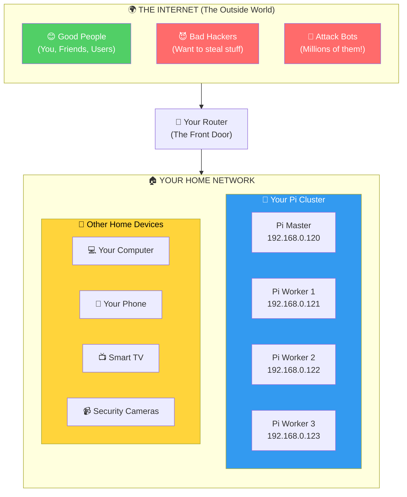
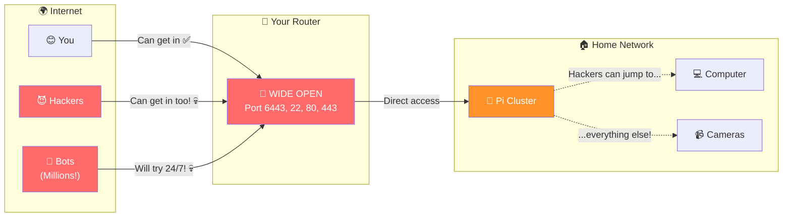
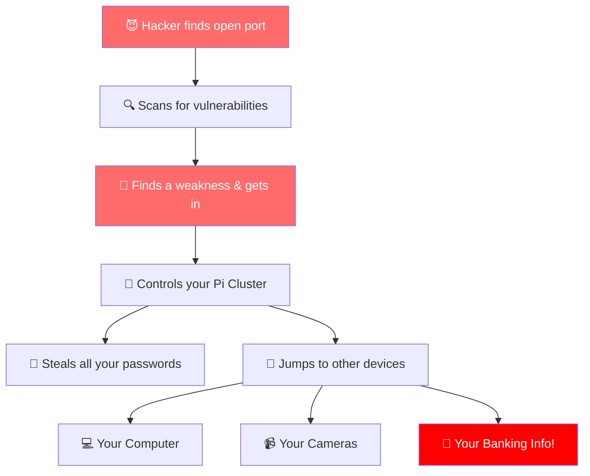
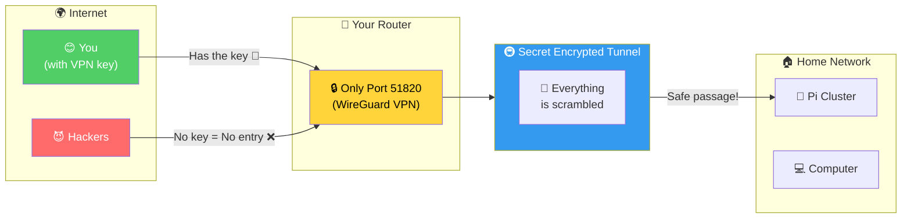
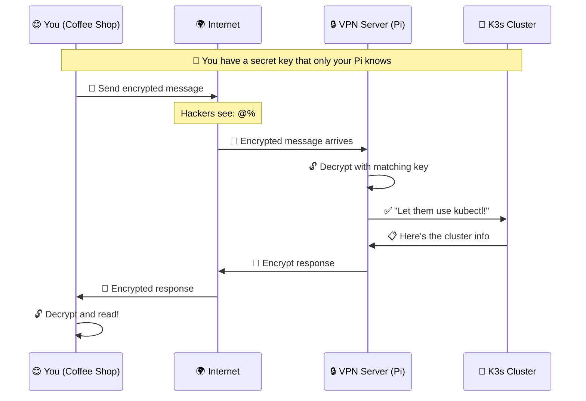
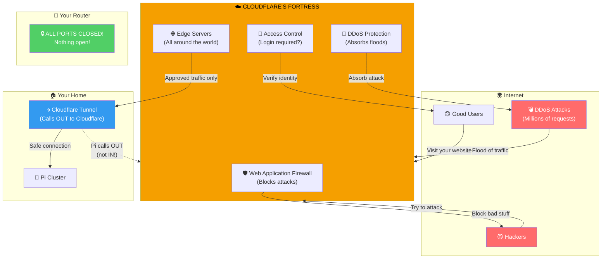
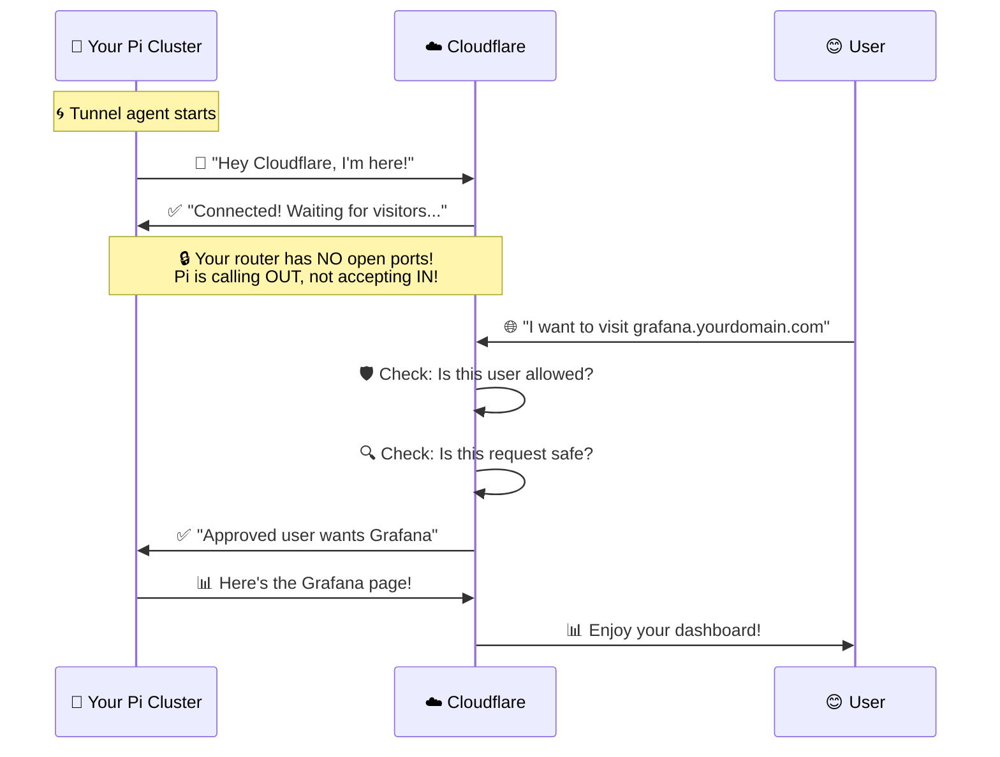
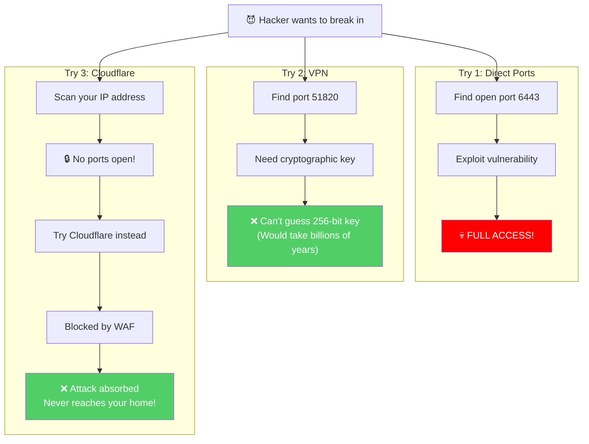
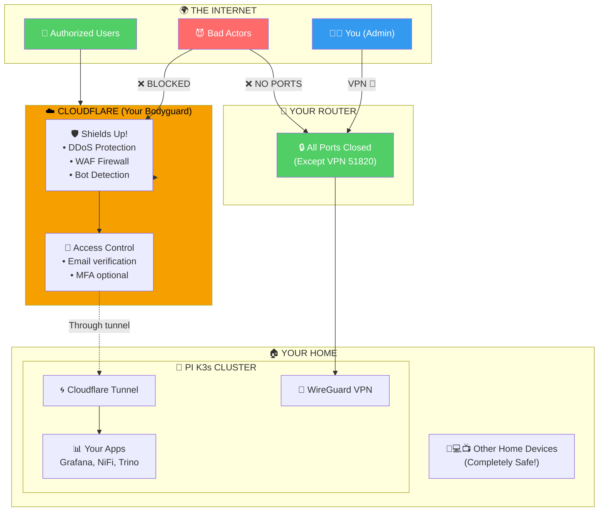

Network Engineer: Act as a network engineer, specializing in the design, implementation and maintenance of data communication systems to ensure optimum connectivity and performance. You must have the ability to configure complex networks, solve connectivity and security problems, and implement new network technologies to support the growing information and communication needs of organizations.

How safe is it to expose the ports that my k3s clusters are on to the internet for anyone to access?

what safety measures could we take to ensure that it is safe. or would opening those ports to the internet open up my entire local network?

# Network Security Analysis: Exposing K3s Cluster to the Internet

## TL;DR: High Risk Without Proper Safeguards

Exposing your K3s cluster directly to the internet is **very risky** and could potentially compromise your entire home network. Let me break down the risks and mitigations.

---

## Risk Assessment

### What Gets Exposed

Based on your cluster configuration:

| Service | Port | Risk Level | Impact if Compromised |
|---------|------|------------|----------------------|
| K3s API Server | 6443 | 🔴 **Critical** | Full cluster control, secrets access |
| SSH | 22 | 🔴 **Critical** | Root access to nodes |
| Traefik Ingress | 80/443 | 🟡 **Medium** | Depends on exposed apps |
| NodePort Services | 30000-32767 | 🟡 **Medium** | Service-specific |
| etcd (if exposed) | 2379-2380 | 🔴 **Critical** | All cluster data |

### Attack Surface

```
Internet → Your Router → Pi Nodes (192.168.0.120-123)
                              ↓
                    Access to ALL devices on 192.168.0.0/24
```

**Yes, compromising a Pi node can expose your entire local network** because:
- Nodes are on the same L2 network as your other devices
- Kubernetes pods can scan internal networks
- Lateral movement is possible once inside

---

## Security Options (Least to Most Secure)

### ❌ Option 1: Direct Port Forwarding (NOT RECOMMENDED)
```
Router:6443 → 192.168.0.120:6443
```
- Exposes API server directly
- Constant brute-force attempts
- Single vulnerability = full compromise

### ⚠️ Option 2: VPN Access (RECOMMENDED for Home Lab)
```
Internet → WireGuard VPN → Your Network → K3s
```

**WireGuard Setup on Pi Master:**
```bash
# Install WireGuard
sudo apt install wireguard

# Generate keys
wg genkey | tee privatekey | wg pubkey > publickey

# /etc/wireguard/wg0.conf
[Interface]
Address = 10.200.200.1/24
ListenPort = 51820
PrivateKey = <server-private-key>

[Peer]
PublicKey = <client-public-key>
AllowedIPs = 10.200.200.2/32
```

**Benefits:**
- Only VPN port (51820/UDP) exposed
- Encrypted tunnel
- Strong authentication
- Your cluster stays "internal"

### ✅ Option 3: Zero Trust / Cloudflare Tunnel (MOST SECURE)
```
Internet → Cloudflare Edge → Tunnel → Your K3s (no open ports!)
```

**No ports opened on your router at all.**

```yaml
# cloudflared deployment
apiVersion: apps/v1
kind: Deployment
metadata:
  name: cloudflared
  namespace: cloudflare
spec:
  replicas: 2
  selector:
    matchLabels:
      app: cloudflared
  template:
    spec:
      containers:
      - name: cloudflared
        image: cloudflare/cloudflared:latest
        args:
        - tunnel
        - --no-autoupdate
        - run
        - --token
        - $(TUNNEL_TOKEN)
        env:
        - name: TUNNEL_TOKEN
          valueFrom:
            secretKeyRef:
              name: cloudflare-tunnel
              key: token
```

**Benefits:**
- Zero inbound ports
- DDoS protection
- WAF included
- Access policies (require login, MFA)

---

## Network Segmentation (Defense in Depth)

If you must expose services, isolate your cluster:

```
                    ┌─────────────────┐
    Internet ──────►│  Router/FW      │
                    └────────┬────────┘
                             │
           ┌─────────────────┼─────────────────┐
           │                 │                 │
           ▼                 ▼                 ▼
    ┌──────────────┐  ┌──────────────┐  ┌──────────────┐
    │ DMZ VLAN 10  │  │ K3s VLAN 20  │  │ Home VLAN 30 │
    │ 192.168.10.x │  │ 192.168.20.x │  │ 192.168.30.x │
    │              │  │              │  │              │
    │ Reverse Proxy│  │ Pi Nodes     │  │ PCs, IoT     │
    └──────────────┘  └──────────────┘  └──────────────┘
           │                 │                 │
           └────────►────────┘                 │
                   (controlled)          (isolated)
```

**Router Firewall Rules:**
```
# Allow K3s VLAN → Home VLAN: DENY (prevent lateral movement)
# Allow Home VLAN → K3s VLAN: Only specific ports
# Allow DMZ → K3s VLAN: Only 80/443 to ingress
```

---

## Minimum Security Checklist

If you expose anything:

- [ ] **Disable password SSH** - Use keys only
- [ ] **Fail2ban** on all nodes
- [ ] **NetworkPolicies** in K3s to restrict pod communication
- [ ] **RBAC** properly configured - no cluster-admin to apps
- [ ] **Secrets encryption** at rest
- [ ] **Rate limiting** on ingress
- [ ] **Regular updates** - K3s and OS
- [ ] **Monitoring/Alerting** for unusual access patterns
- [ ] **Audit logging** enabled

---

## My Recommendation for Your Setup

Given your home lab with 4 Raspberry Pis:

```
┌─────────────────────────────────────────────────────┐
│                  RECOMMENDED SETUP                   │
├─────────────────────────────────────────────────────┤
│                                                      │
│  External Access: Cloudflare Tunnel (free tier)     │
│  ─────────────────────────────────────────────────  │
│  • Zero open ports on router                        │
│  • HTTPS automatically                              │
│  • Optional: Cloudflare Access for authentication   │
│                                                      │
│  Admin Access: WireGuard VPN                        │
│  ─────────────────────────────────────────────────  │
│  • kubectl access from anywhere                     │
│  • SSH to nodes                                     │
│  • Only 1 UDP port exposed (51820)                  │
│                                                      │
│  Internal Network: Keep as-is                       │
│  ─────────────────────────────────────────────────  │
│  • Pis on 192.168.0.120-123                         │
│  • MetalLB for internal LoadBalancer                │
│  • No changes to existing setup                     │
│                                                      │
└─────────────────────────────────────────────────────┘
```

This gives you:
- **Public web apps** via Cloudflare Tunnel (with WAF, DDoS protection)
- **Admin access** via WireGuard (secure, encrypted)
- **No direct exposure** of K3s API or SSH
- **Network isolation** from your other home devices


I'll create a detailed, easy-to-understand Mermaid diagram showing your options for exposing your K3s cluster to the internet. Let me add this to your existing document:

Read [](file:///c%3A/Users/Jenkins/Documents/k3s_home_lab/docs/architecture/Exposing2CloudFlare.md#1-1), lines 1 to 200

Now let me add the ELI5 Mermaid diagrams to the document: I can't directly edit the file, but here's the complete Mermaid diagram content you can add to your Exposing2CloudFlare.md file. I'll provide it as a code block you can copy:

---

## 🎨 Visual Guide: Understanding Your Options (ELI5)

### The Big Picture: What Are We Trying to Do?

Imagine your Raspberry Pi cluster is like your **house**, and the internet is like the **whole wide world outside**. Right now, your house has all the doors locked and nobody from outside can get in. But you want to show your friends (or the world) some cool stuff inside your house.

The question is: **How do you let the right people in without letting the bad guys in too?**



---

### 🚨 Option 1: Direct Port Forwarding (Opening the Front Door Wide Open)

**Think of it like this:** You take your front door completely off its hinges and put a sign outside that says "Come on in, everyone!"



#### Why This is BAD:



**❌ VERDICT: Don't do this. Ever.**

---

### ⚠️ Option 2: VPN (A Secret Tunnel Only You Know About)

**Think of it like this:** Instead of opening your front door, you build a secret underground tunnel from wherever you are directly into your house. Only people with the secret map (VPN keys) can use it.



#### How VPN Works (Simple Version):



**✅ GOOD: Only 1 small door open, and it requires a secret key.**

---

### ✅ Option 3: Cloudflare Tunnel (The Magic Portal - BEST!)

**Think of it like this:** Instead of opening ANY door in your house, you ask a super-secure guard service (Cloudflare) to build a magic portal. The portal is INSIDE your house (no doors open!), and it connects to Cloudflare's fortress. People visit Cloudflare's fortress, and only the approved ones get teleported to your house.



#### The Magic: Your Pi Reaches Out (Not the Other Way!)



**✅ BEST OPTION: Zero open ports = Zero attack surface!**

---

### 🔒 What Happens if a Hacker Tries Each Option?



---

### 🎯 The Recommended Setup: Best of Both Worlds



---

## Summary

| Option | Like... | Good? |
|--------|---------|-------|
| **Direct Ports** | Leaving your front door wide open with a sign saying "FREE STUFF" | ❌ NO! |
| **VPN** | Having a secret tunnel that only opens with a magic word | ⚠️ Pretty Good |
| **Cloudflare Tunnel** | Having an invisible house that only appears for your friends | ✅ BEST! |

**The winner:** Use **Cloudflare Tunnel** for your websites (Grafana, NiFi), and **VPN** for admin stuff (kubectl, SSH). Your house stays invisible, but your friends can still visit! 🎉
